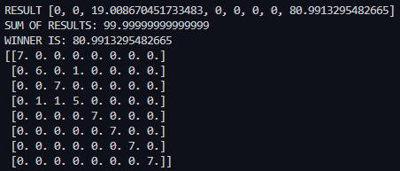
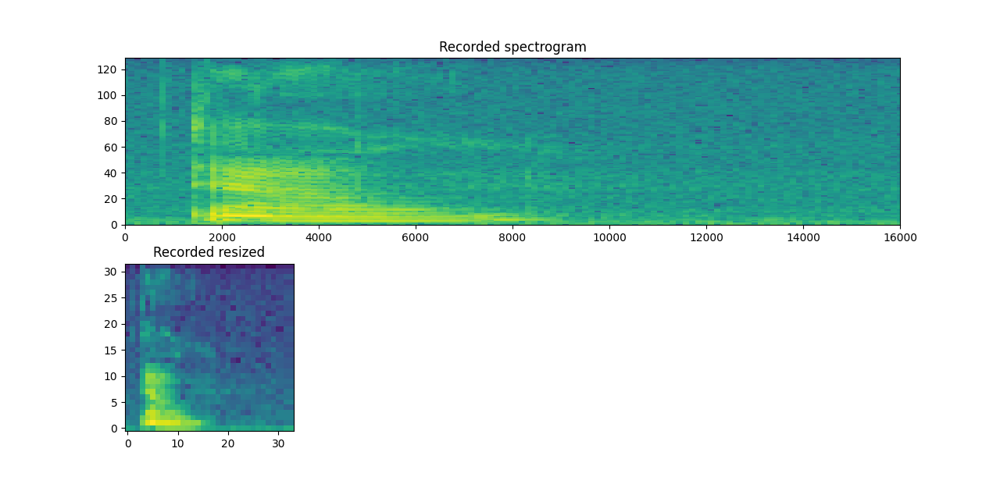
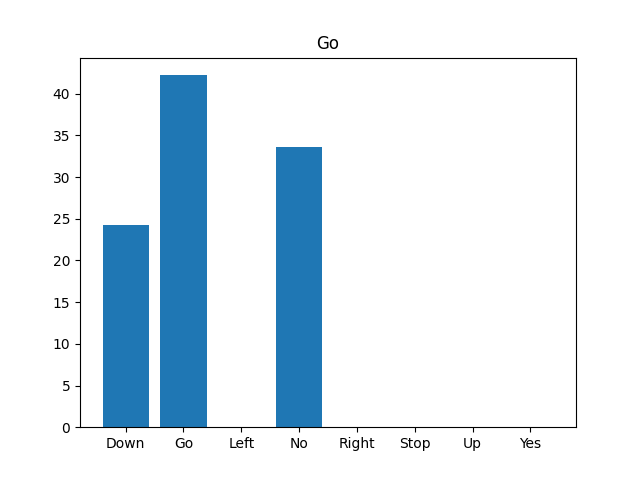
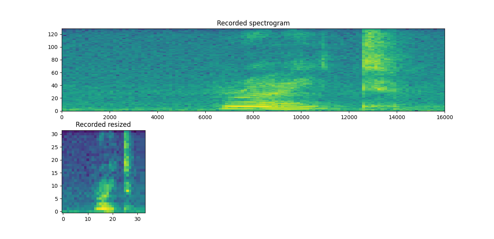
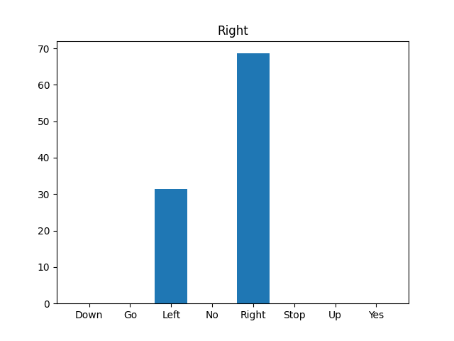

# SimpleVoiceCommands
A neural network that recognizes simple voice commands. 
This is a summer project for Oulu University of Applied Sciences and the members of the project group were Petteri Karjalainen, Henna Niemi, Kasperi Sänkiniemi and Riku Tuisku.

The main goal of the project was to implement functions from scratch to create a neural network for recognizing simple voice commands using Python and a pretrained model. The model was trained using this Tensorflow tutorial: (https://www.tensorflow.org/tutorials/audio/simple_audio), which uses a portion of a Speech Commands dataset containing one second clips of eight speech commands, "down", "go", "left", "no", "right", "stop", "up" and "yes", in WAV format. In the first stage of the project the voice commands were read from WAV files from the Speech Commands dataset and later the program was changed to use commands recorded with the computer microphone. There was an additional goal of implementing the same functions with C++ in the case that there would be time left after completing the main goal.

## Converting the audio into an image
The one second audio clip is converted into a spectrogram by performing Discrete Fourier Transform to the waveform in sequences of 256 values. The output of this operation is an image of size 129 x 124 pixels. The image is then resized to 32 x 32 pixels and the new pixel values are calculated using bilinear interpolation, in which the average of the four nearest pixels is calculated with more weight put on the pixels closest to the new pixel.

## Convolutional layers
The convolutional layer consists of 2 parts of convolution and maxpooling.
The first convolution uses the filters from filters_conv1 folder and reads them one by one. It performs cross-correlation on a single image and after that, the bias values are added. Lastly ReLU is used to remove all negative values and then the image is saved as a csv file. This will loop 32 times until 32 outputs have been saved.

The cross-correlation code itself takes the image shape in row and col. It uses the row and col data to get an identical sized copy of the original image to be used as a base to add values to it.

 Lastly the image is looped with slicing to get specific sized chunks from the image which will be multiplied by kernel values and then all elements will be summed together. Lastly the result of it will be placed in a specific block in output.

 

 The second convolution performs very much the same, like in convolution1, but convolution2 has 32 channels which have 64 filters, and it uses the 32 outputs from convolution 1.
Convolution 2 takes the output images from convolution1, then uses the channel1 filter 1 as a kernel and performs cross-correlation to generate an image.
After all, 32 channels have been gone through from convolution2 and summed together with all outputs from convolution 1, the bias values are added and then the ReLU is used to remove all negative values, lastly the result will be saved as a csv file. 
When the steps are done, filter number in convolution2 will rise by one and then will go through the same steps until all 64 filters have been looped through and 64 outputs have been saved as a csv file.

maxPooling takes the original image size and halves the size to get row and col, which will be used as a base to make a copy filled with zeros. 

The image is looped and sliced through to get specific chunks, which will be used to get the maximum value of that chunk, and then the result will be added to the corresponding slot in the base which was filled with zeros.

After the loop is done, all zeros are gone from the base and replaced with maximum values.

## Flatten and dense layers
The flatten function converts the 64 14x14 images produced by the Convolutional layers and maxPooling into a one-dimensional array. The Dense layers are fully connected layers, in which a weighted sum of each input is calculated for each output and a bias is added to it. The dense_1 function takes the output of the flatten function as input and produces 128 outputs using weights and biases from the trained model and also applies a ReLU (rectified linear unit) activation function, which turns negative values to zero. Dense_2 takes those outputs as input and outputs an array of 8 values, which correspond to the eight commands. The command that received the highest value, is the networks prediction for the command given.

## Recording the commands with a microphone
In the second stage of the project the voice commands were recorded using the PyAudio library to record a one second audio clip with the computer microphone.

There was some difficulty with getting the command recorded completely and to try to fix this another function was made for starting the recording when a certain sound threshold is exceeded.

## Results
The accuracy of the predictions was tested with a confusion matrix of classifications of a test set containing seven of each command. The predictions were least accurate with commands that sound similar to another command, such as "Go" and "No", as could be expected, and overall the accuracy on this small sample indicated that the program is working as intended.

When using recorded audio from a microphone the accuracy of the predictions was lowered. This was possibly caused by poorer quality of the audio due to background noise and difficulty in getting the command fully recorded in the one second clip. The two images below show the command Down predicted as Go.

 

The command Right predicted correctly:

 

As a conclusion a program for predicting voice commands from both audio files and recorded audio using neural networks and a pre-trained model was achieved. In addition some of the functions were also implemented in C++, but not a whole neural network.

