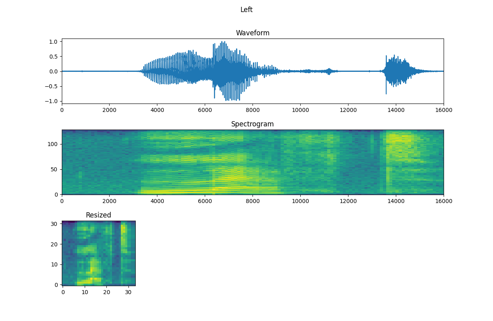
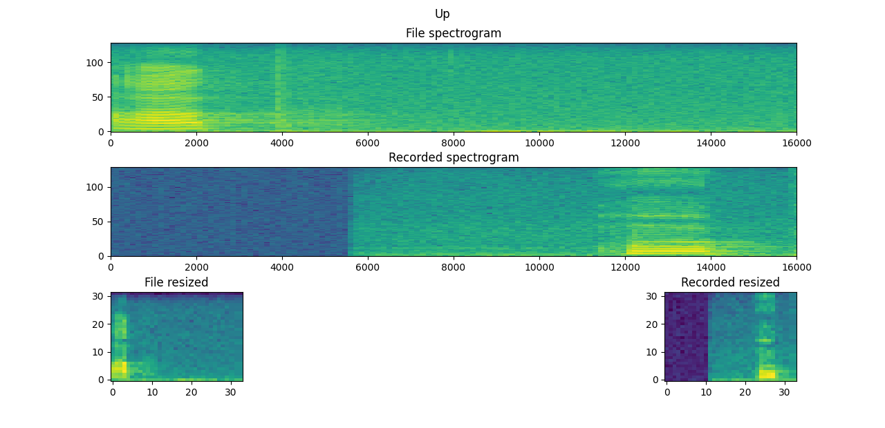
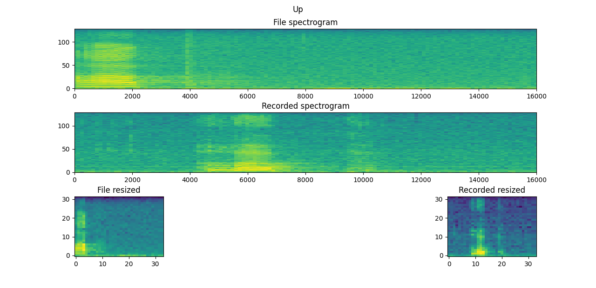

# SimpleVoiceCommands
A neural network that recognizes simple voice commands. 
This is a summer project for Oulu University of Applied Sciences and the members of the project group were Petteri Karjalainen, Henna Niemi, Kasperi Sänkiniemi and Riku Tuisku.

The main goal of the project was to implement functions from scratch to recognize simple voice commands using Python and a pretrained model. The model was trained using this Tensorflow tutorial: (https://www.tensorflow.org/tutorials/audio/simple_audio), which uses a portion of a Speech Commands dataset containing one second clips of eight speech commands, "down", "go", "left", "no", "right", "stop", "up" and "yes", in WAV format. In the first stage of the project the voice commands were read from WAV files from the Speech Commands dataset and later the program was changed to use commands recorded with the computer microphone. There was an additional goal of implementing the same functions with C++ in the case that there would be time left after completing the main goal.

## Converting the audio into an image
The one second audio clip is converted into a spectrogram by performing Discrete Fourier Transform to the waveform in sequences of 256 values. The output of this operation is an image of size 129 x 124 pixels. The image is then resized to 32 x 32 pixels and the new pixel values are calculated using bilinear interpolation, in which the average of the four nearest pixels is calculated with more weight put on the pixels closest to the new pixel.

## Normalization layer

## Convolutional layers

## Flatten and dense layers

## Recording the commands with a microphone
In the second stage of the project the voice commands were recorded using the computer microphone to record a one second audio clip.

There was some difficulty with getting the command recorded completely and to try to fix this another function was made for starting the recording when a certain sound threshold is exceeded.

## Results
The accuracy of the predictions was tested with a confusion matrix of classifications of a test set containing seven of each command. The predictions were least accurate with commands that sound similar to another command, such as "Go" and "No", as could be expected, and overall the accuracy on this small sample indicated that the program is working as intended.

When using recorded audio from a microphone the accuracy of the predictions was lowered. This was possibly caused by poorer quality of the audio due to background noise and difficulty in getting the command fully recorded in the one second clip.

 

 

As a conclusion a program for predicting voice commands from both audio files and recorded audio using neural networks and a pre-trained model was acchieved. In addition some of the functions were also implemented in C++, but not a whole program.

